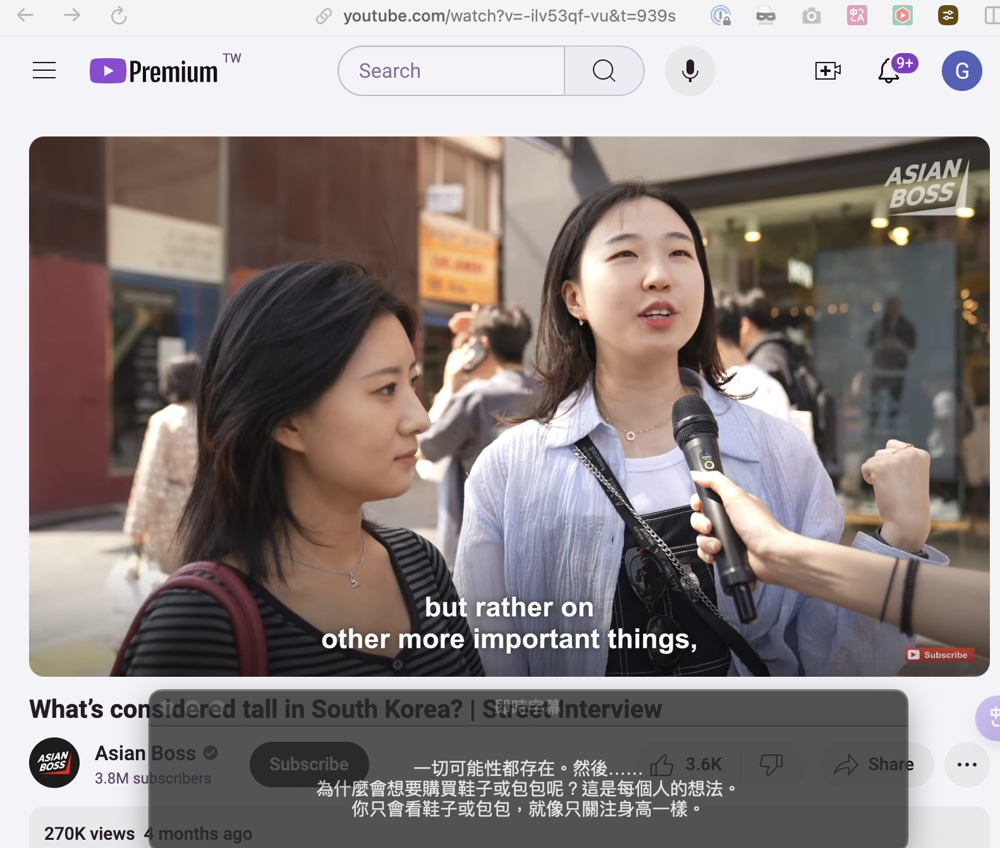

# Real-time Audio Transcription and Translation System
這是一個即時音訊轉錄與翻譯系統，可以捕獲系統音訊或麥克風輸入，並轉換成文字及翻譯。系統使用 MLX Whisper 進行語音轉文字，並使用 GPT 進行翻譯。



## 系統需求
- macOS 系統
- Python 3.10+
- Swift 6.0+ (僅用於系統音訊捕獲)
- MLX 框架支援
- OpenAI API 金鑰（用於翻譯功能）

## 安裝 uv 依賴管理工具
```bash
brew install uv
```

## 安裝步驟
1. 安裝 Python 依賴：
```bash
uv sync
```

2. 編譯 Swift 音訊捕獲程式（若需要系統音訊捕獲）：
```bash
swift build -c release
```

3. 設定環境變數：
```bash
export OPENAI_API_KEY='your-api-key-here'
```

## 使用方法
### 基本使用
使用系統音訊：
```bash
python whisper.py
```

使用麥克風輸入：
```bash
python whisper.py -m
```

### 其他選項
```bash
python whisper.py [-f [FILENAME]] [-d] [-m]
```

參數說明：
- `-f, --file`: 儲存音訊到 WAV 檔案
  - 不帶參數：使用自動生成的檔名（格式：audio_capture_YYYYMMDD_HHMMSS.wav）
  - 帶參數：使用指定的檔名
- `-d, --debug`: 啟用除錯輸出，包含處理時間
- `-m, --mic`: 使用麥克風輸入代替系統音訊

## 功能特點
- 支援系統音訊和麥克風輸入
- 即時語音轉文字
- 即時英文到中文翻譯
- 可切換顯示原文/僅顯示翻譯
- 可選的音訊檔案儲存
- 使用 MLX Whisper 進行高效能語音識別
- 支援中斷操作（Ctrl+C）
- 半透明浮動視窗介面

## 注意事項
- 首次執行時需要下載 Whisper 模型，這可能需要一些時間
- 確保系統有足夠的權限存取音訊裝置
- 音訊轉換和翻譯過程中可能會有一些延遲，這是正常現象
- 使用系統音訊捕獲時，需要先編譯 Swift 程式
- 需要有效的 OpenAI API 金鑰才能使用翻譯功能
